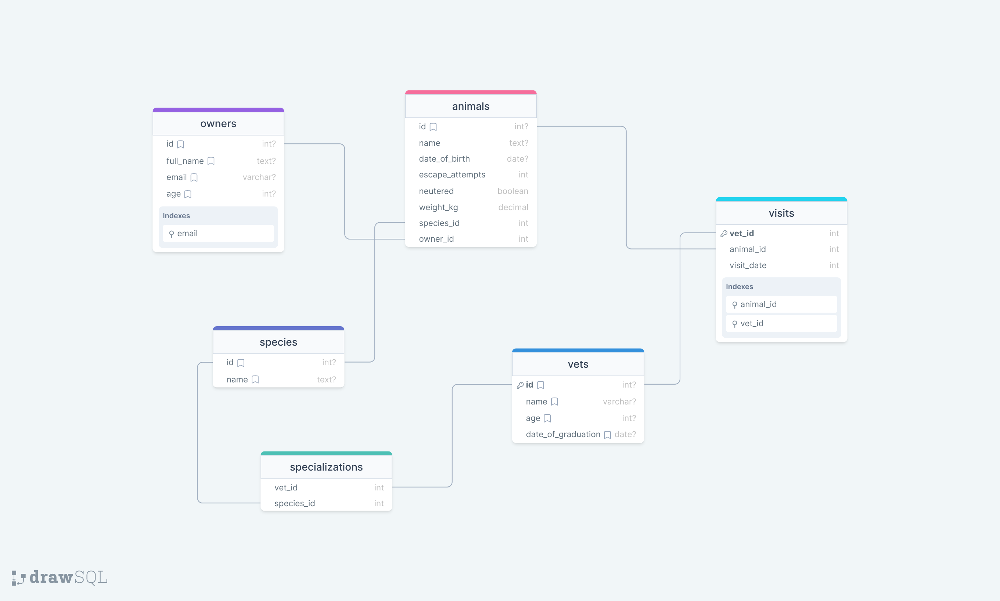

# Vet clinic database

Vet clinic database is a database schema for a veterinary clinic. It is built using PostgreSQL.

## Database schema diagram

## Getting Started

This repository includes files with plain SQL that can be used to recreate a database:

- Use [schema.sql](./schema.sql) to create all tables.
- Use [data.sql](./data.sql) to populate tables with sample data.
- Check [queries.sql](./queries.sql) for examples of queries that can be run on a newly created database. **Important note: this file might include queries that make changes in the database (e.g., remove records). Use them responsibly!**

## Authors

👤 **Desmond Owusu Ansah**

- Github [@Owusu-Desmond](https://github.com/Owusu-Desmond)
- Twitter [@DesmondOwusuDev](https://twitter.com/DesmondOwusuDev)
- LinkedIn [@desmond-owusu-ansah](https://www.linkedin.com/in/desmond-owusu-ansah-09274a223/)
- Dev.to [desmondowusudev](https://dev.to/desmondowusudev)

## 🤝 Contributing

Contributions, issues, and feature requests are welcome!

Feel free to check the [issues page](https://github.com:Owusu-Desmond/vet-clinic-database/issues/).

## Show your support

Give a ⭐️ if you like this project!

## Acknowledgments

- Hat tip to anyone whose code was used
- Inspiration
- etc

## 📝 License

This project is [MIT](./LICENSE) licensed.
